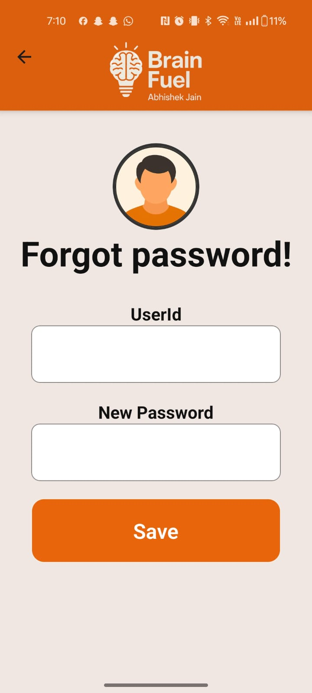
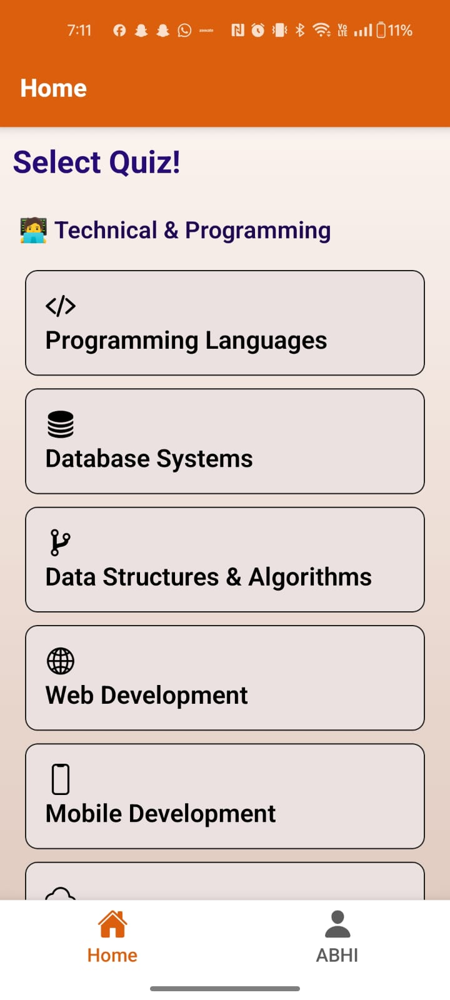
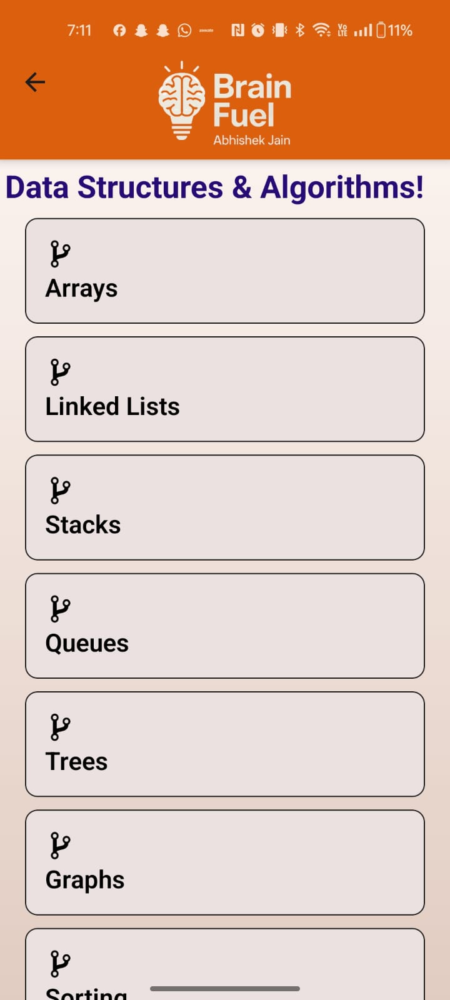
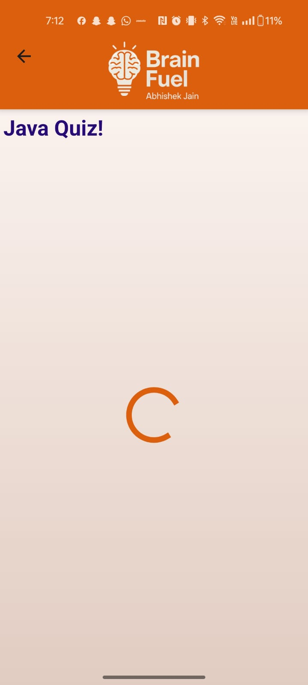
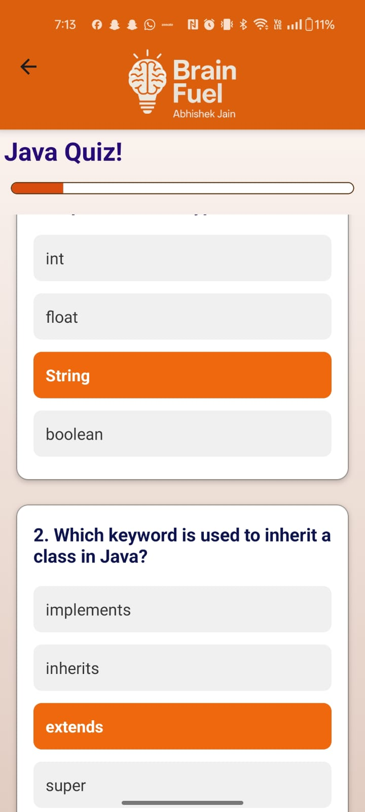
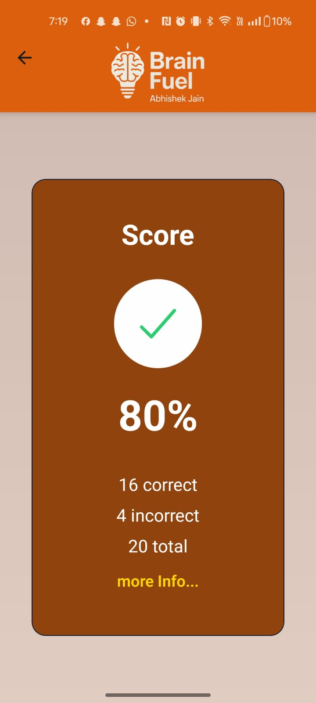
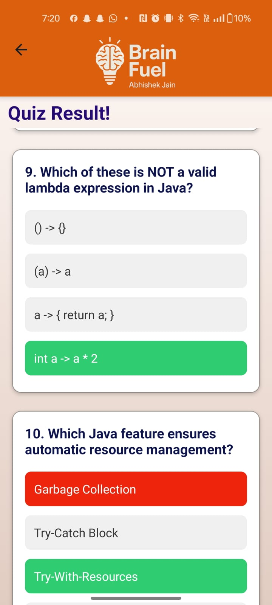
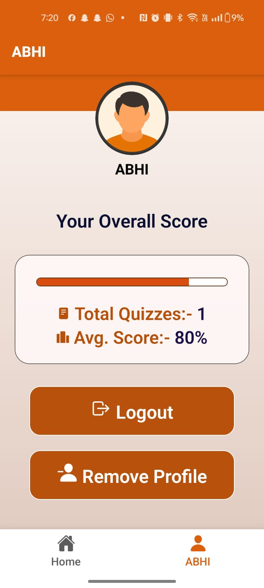

<h1 align="center">🧠 BrainFuel</h1>
<p align="center">
  
</p>
<p align="center">
  <strong>A smart, scalable quiz app for Android built with React Native</strong><br/>
  <em>Interview prep, academic practice, and performance tracking — all in one.</em>
</p>

<p align="center">
  <a href="#"></a>
  <a href="#"></a>
</p>

---

## Table of Contents

- [Screenshots](#screenshots)
- [Features](#features)
- [Download APK](#download-apk)
- [Installation & Setup](#installation--setup)

---

## Screenshots

<p align="center">
  
</p>

<div align="center">
  
  <br/>
  🔐 <strong>Login Page</strong> – Secure user authentication
</div>
<br/>

<div align="center">
  
  <br/>
  🔑 <strong>Forgot Password</strong> – Password recovery interface
</div>
<br/>

<div align="center">
  
  <br/>
  🏠 <strong>Home Window</strong> – Select quiz categories
</div>
<br/>

<div align="center">
  
  <br/>
  🧭 <strong>Subcategory Window</strong> – Choose topics like Java, Python, etc.
</div>
<br/>

<div align="center">
  
  <br/>
  ⏳ <strong>Quiz Loading</strong> – Prepares quiz content
</div>
<br/>

<div align="center">
  
  <br/>
  📝 <strong>Quiz Content</strong> – Displays questions with options
</div>
<br/>

<div align="center">
  
  <br/>
  ⚠️ <strong>Submission Alert</strong> – Confirms quiz submission
</div>
<br/>

<div align="center">
  
  <br/>
  🧮 <strong>Score Window</strong> – Shows quiz score
</div>
<br/>

<div align="center">
  
  <br/>
  📊 <strong>Result Window</strong> – Correct answers vs user selections
</div>
<br/>

<div align="center">
  
  <br/>
  👤 <strong>User Profile</strong> – Tracks total quizzes, average score, logout/delete options
</div>

---

## Features

- 🎯 50+ Quiz Categories with subtopics like Programming, Aptitude, GK, and more  
- 🧠 20 Questions per Quiz, randomized with difficulty levels: Easy, Medium, Hard  
- 🌐 Web-Scraped Questions from 50+ trusted sources for interview and exam relevance  
- 📈 Real-Time Performance Tracking with average score and quiz history  
- ✅ Result Review with correct answers and user selections  
- 🔄 Cross-Platform Codebase – Clone and run on iOS with minimal changes  
- 🎨 Polished UI/UX with theme-consistent visuals and smooth navigation  

---

## Download APK

<p align="center">
  
</p>

<p align="center">
  <strong>Download BrainFuel for Android</strong><br/>
  Your personal quiz companion with 50+ categories, curated questions, and real-time performance tracking.
</p>

<p align="center">
  <a href="BrainFuel_APK/BrainFuel.apk" download>
    
  </a>
</p>

> ⚠️ iOS users can clone the repository and build using React Native CLI or Expo for iOS deployment.

---

## Installation & Setup

```bash
# Clone the repository
git clone https://github.com/your-username/BrainFuel.git
cd BrainFuel

# Install dependencies
npm install

# Start the development server
npx expo start
