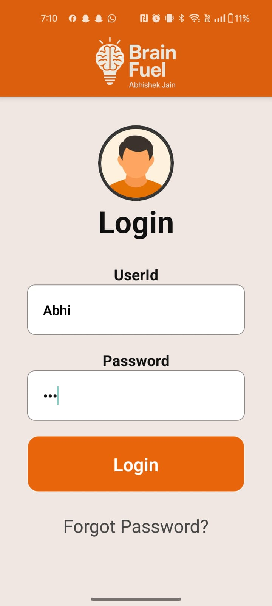

<h1 align="center">🧠 BrainFuel</h1>
<p align="center">
  
</p>
<p align="center">
  <strong>A smart, scalable quiz app for Android built with React Native</strong><br/>
  <em>Interview prep, academic practice, and performance tracking — all in one.</em>
</p>

<p align="center">
  <a href="#"></a>
  <a href="#"></a>
  <a href="#"></a>
</p>

---

## 📚 Table of Contents

- [📸 Screenshots](#-screenshots)
- [🚀 Features](#-features)
- [📥 Download APK](#-download-apk)
- [🔧 Installation & Setup](#-installation--setup)
- [👤 User Profile & Analytics](#-user-profile--analytics)
- [🧪 Quiz Logic & Data](#-quiz-logic--data)
- [🤝 Contributing](#-contributing)
- [📄 License](#-license)
- [📬 Contact](#-contact)

---

## 📸 Screenshots

| Screen | Description |
|--------|-------------|
|  | 🔐 **Login Page** – Secure user authentication |
|  | 🔑 **Forgot Password** – Password recovery interface |
|  | 🏠 **Home Window** – Select quiz categories |
|  | 🧭 **Subcategory Window** – Choose topics like Java, Python, etc. |
| | ⏳ **Quiz Loading** – Prepares quiz content |
|  | 📝 **Quiz Content** – Displays questions with options |
|  | ⚠️ **Submission Alert** – Confirms quiz submission |
| | 🧮 **Score Window** – Shows quiz score |
|  | 📊 **Result Window** – Correct answers vs user selections |
|  | 👤 **User Profile** – Tracks total quizzes, average score, logout/delete options |

---

## 🚀 Features

- 🎯 **50+ Quiz Categories** with subtopics like Programming, Aptitude, GK, and more
- 🧠 **20 Questions per Quiz**, randomized with difficulty levels: Easy, Medium, Hard
- 🌐 **Web-Scraped Questions** from 50+ trusted sources for interview and exam relevance
- 📈 **Real-Time Performance Tracking** with average score and quiz history
- ✅ **Result Review** with correct answers and user selections
- 🔄 **Cross-Platform Codebase** – Clone and run on iOS with minimal changes
- 🎨 **Polished UI/UX** with theme-consistent visuals and smooth navigation

---

## 📥 Download APK

Click below to download the latest Android APK:

<p align="center">
  <a href="BrainFuel_APK/BrainFuel.apk">
    
  </a>
</p>

> ⚠️ iOS users can clone the repository and build using React Native CLI or Expo for iOS deployment.

---

## 🔧 Installation & Setup

```bash
# Clone the repository
git clone https://github.com/your-username/BrainFuel.git
cd BrainFuel

# Install dependencies
npm install

# Start the development server
npx expo start
